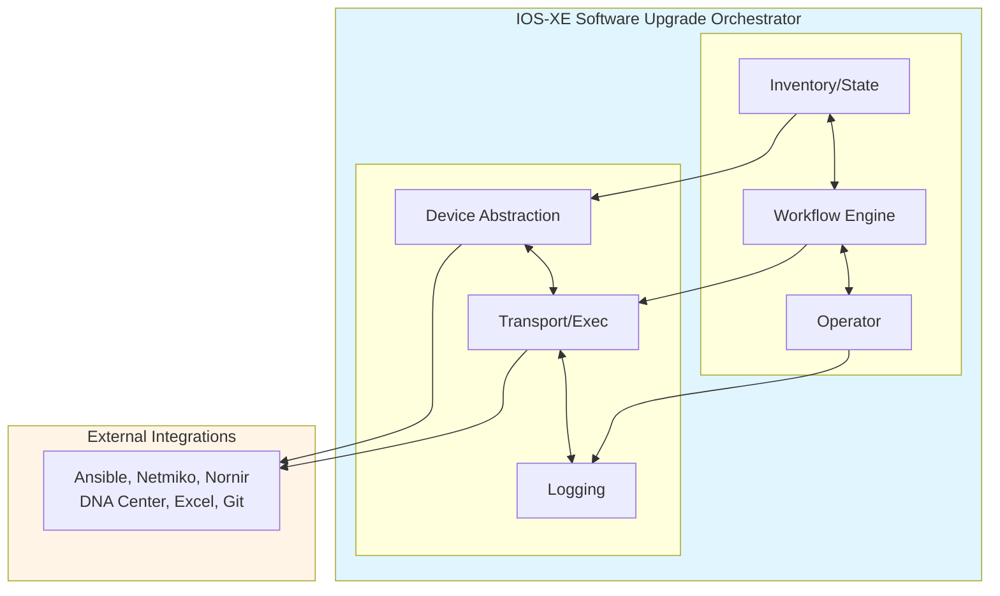
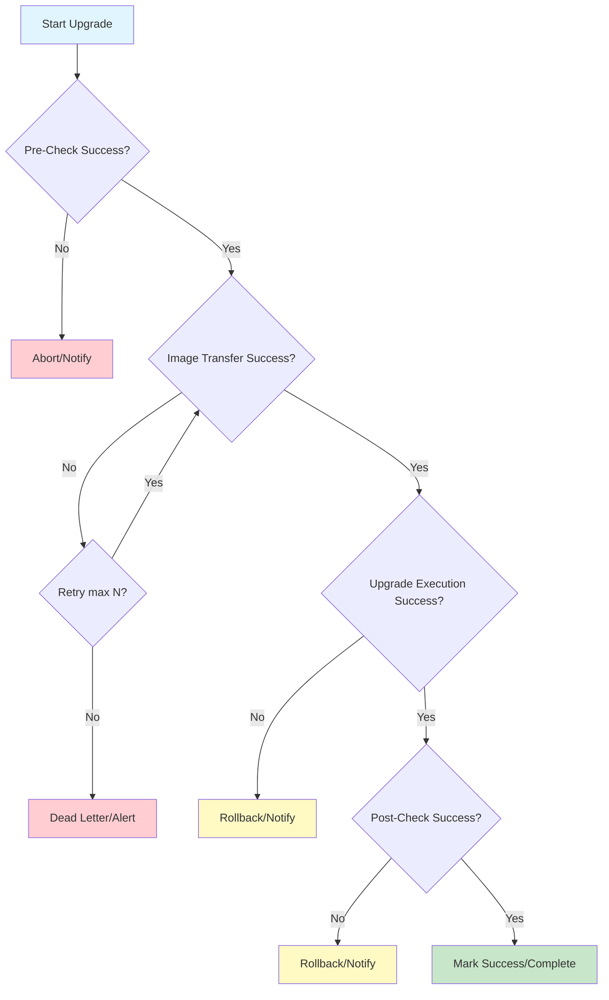
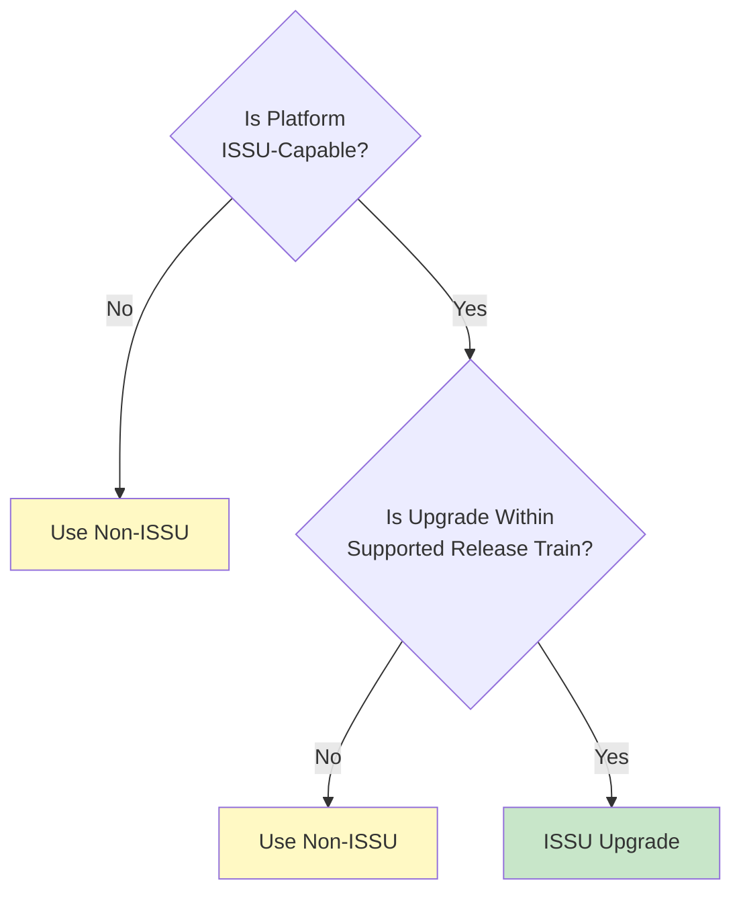
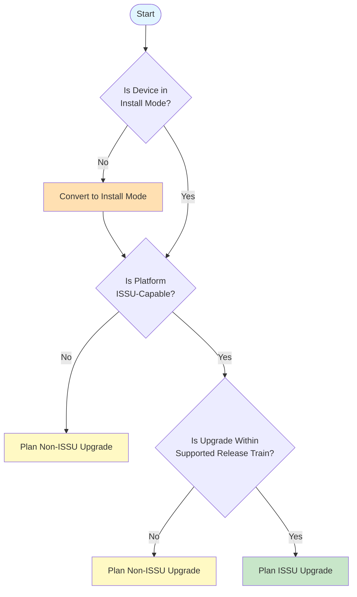
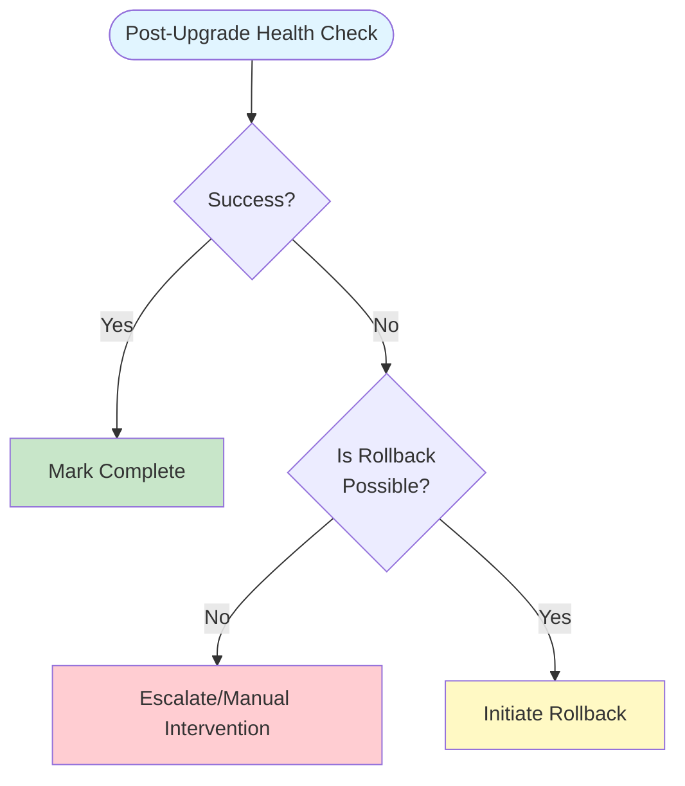

!!! info "Project Status: Design & Planning Phase"
    This document represents the comprehensive design blueprint for an upcoming automation tool. Implementation is currently in the planning stage.

---

## Quick Reference

**Jump to Section:**

- [High-Level Architecture](#high-level-architecture) - System components and design philosophy
- [Workflow Stages](#workflow-stages-end-to-end-upgrade-process) - End-to-end upgrade process breakdown
- [Platform-Specific Handling](#edge-case-handling) - ISSU, dual SUPs, StackWise considerations
- [Rollback Mechanisms](#7-rollback-and-recovery) - Recovery strategies and procedures
- [Security Considerations](#security-considerations) - Credential management and access controls
- [Module Breakdown](#modular-breakdown-key-components) - Detailed component architecture

---

## Introduction

Upgrading Cisco IOS-XE devices is a critical, high-stakes operation for enterprise and service provider networks. The process is fraught with complexity, risk, and platform-specific nuances. Manual upgrades are time-consuming, error-prone, and difficult to scale. Automation is essential for maintaining network security, stability, and compliance, especially as device fleets grow and maintenance windows shrink. This document presents a comprehensive design and planning blueprint for a Python-based "IOS-XE Software Upgrade Orchestrator." The orchestrator aims to automate the end-to-end upgrade process for Cisco IOS-XE devices, supporting image validation, pre-checks, image transfer, upgrade execution, post-checks, and robust rollback mechanisms. The design emphasizes modularity, fault tolerance, scalability, and integration with an Excel-driven source-of-truth and CLI-based operator workflows.

---

## High-Level Architecture

### Architectural Overview

The orchestrator is conceived as a modular, extensible Python application capable of orchestrating upgrades across diverse IOS-XE platforms (Catalyst 9k, ISR, ASR, NCS, etc.). It interfaces with devices via SSH/CLI, leverages an Excel (or CSV) file as the authoritative inventory and configuration source, and supports integration with existing automation frameworks (e.g., Ansible, Netmiko, Nornir).

**Key architectural components:**

- **Inventory and State Management Layer:** Reads and writes device inventory, upgrade status, and configuration data from/to Excel or a similar source-of-truth.  
- **Device Abstraction Layer:** Encapsulates platform-specific logic and provides a uniform interface for device operations.  
- **Workflow Engine:** Orchestrates the upgrade process, managing workflow stages, error handling, and operator interactions.  
- **Transport and Execution Layer:** Handles CLI connections, command execution, and file transfers (SCP, TFTP, HTTP).  
- **Logging and Observability Layer:** Provides detailed logging, telemetry, and audit trails for compliance and troubleshooting.  
- **Operator Interaction Layer:** Supports CLI-based prompts, approvals, and rollback triggers, enabling human-in-the-loop workflows.

**Architecture Diagram:**



This layered approach ensures separation of concerns, extensibility, and maintainability. Each module can be independently developed, tested, and replaced as requirements evolve.

---

## Workflow Stages: End-to-End Upgrade Process

A robust upgrade orchestrator must implement a well-defined, repeatable workflow. Each stage is designed to be idempotent, fault-tolerant, and capable of handling partial failures or retries.

### 1. Discovery and Inventory

**Purpose:** Identify target devices, gather current state, and validate readiness for upgrade.

- **Inventory Source:** Devices and upgrade parameters are sourced from an Excel file (or CSV/DB), which acts as the single source-of-truth (SoT).
- **Discovery Mechanisms:** Use CDP/LLDP, SNMP, or CLI-based discovery to validate device reachability and gather hardware/software details.
- **State Collection:** Collect current software version, boot mode (install vs. bundle), available flash space, redundancy status (dual SUPs, StackWise), and platform type.

**Best Practices:**

- Ensure inventory is up-to-date and validated against live device data.
- Use unique device identifiers (hostname, serial, management IP) to avoid ambiguity.
- Maintain upgrade state and history in the source-of-truth for auditability.

!!! warning "Common Pitfalls"
    - Stale or inconsistent inventory data leading to missed or duplicate upgrades.
    - Incomplete discovery of stack members or redundant supervisors.

### 2. Image Selection and Validation

**Purpose:** Select the appropriate IOS-XE image, validate compatibility, and ensure integrity.

- **Image Selection:** Choose image based on platform, desired version (preferably LTS for stability), and compatibility with hardware modules.
- **Compatibility Checks:** Cross-reference Cisco release notes for memory, hardware, and feature compatibility.
- **Integrity Verification:** Validate image using MD5/SHA2 checksums before and after transfer.
- **Image Repository:** Support local, network (SCP/TFTP/HTTP), or cloud-based image repositories.

**Best Practices:**

- Always use images downloaded from Cisco.com and verify cryptographic hashes.
- Maintain a catalog of approved images and their checksums in the source-of-truth.
- Automate compatibility checks using structured release note data where possible.

!!! warning "Common Pitfalls"
    - Skipping hash verification, leading to device boot failures due to corrupt images.
    - Selecting images incompatible with hardware or feature requirements.

### 3. Pre-Upgrade Checks

**Purpose:** Assess device health, backup configurations, and ensure upgrade prerequisites are met.

- **Health Checks:** Verify device uptime, CPU/memory utilization, interface/link status, and redundancy state.
- **Backup:** Save running and startup configurations, current image, and critical logs to a remote server (TFTP/SCP/FTP).
- **Flash Space:** Check available storage and remove inactive packages if necessary.
- **Redundancy/HA:** Confirm stateful switchover (SSO) readiness for dual SUPs or StackWise Virtual.
- **Maintenance Window:** Validate that upgrade is scheduled within an approved window.

**Best Practices:**

- Automate pre-checks and halt the workflow if any critical check fails.
- Store backups with clear naming conventions and timestamps for easy retrieval.
- Document all pre-check results for compliance and troubleshooting.

!!! warning "Common Pitfalls"
    - Insufficient flash space causing upgrade failures.
    - Missing configuration backups, complicating recovery from failed upgrades.

### 4. Image Transfer

**Purpose:** Reliably transfer the validated image to the device using secure and efficient protocols.

- **Supported Protocols:** SCP (preferred for security), SFTP, FTP, TFTP, HTTP/HTTPS.
- **Transfer Validation:** Verify image integrity post-transfer using hash checks.
- **Parallelization:** For large-scale upgrades, batch transfers to avoid network congestion.

#### Comparison Table: Image Transfer Methods

| Protocol | Security | Speed | Authentication | Use Case                  |
|----------|----------|-------|----------------|---------------------------|
| SCP      | High     | Fast  | Yes            | Preferred for secure envs |
| SFTP     | High     | Medium| Yes            | Secure, slower than SCP   |
| FTP      | Low      | Medium| Yes            | Legacy, avoid if possible |
| TFTP     | None     | Fast  | No             | Simple, not secure        |
| HTTP(S)  | High     | Fast  | Yes (HTTPS)    | Modern, scalable          |

!!! tip "Protocol Selection"
    SCP and HTTPS are preferred for secure environments. TFTP is fast but insecure and should be avoided unless in isolated, trusted networks. Always verify image integrity after transfer.

**Best Practices:**

- Use SCP or HTTPS for all production upgrades.
- Automate retries with exponential backoff in case of transient network failures.
- Log transfer times and throughput for performance monitoring.

!!! warning "Common Pitfalls"
    - Firewall or ACLs blocking transfer ports.
    - Incomplete or interrupted transfers leading to corrupt images.

### 5. Upgrade Execution

**Purpose:** Perform the actual software upgrade using platform-appropriate methods.

- **Upgrade Modes:** Support both Install Mode (recommended for Catalyst 9k and modern platforms) and Bundle Mode (legacy).
- **Commands:**
  - **Install Mode:** `install add file ...`, `install activate`, `install commit`
  - **Bundle Mode:** Copy `.bin` to flash, update boot variable, reload
- **Redundancy Handling:** For dual SUPs or StackWise Virtual, coordinate upgrade steps to maintain HA and minimize downtime.
- **ISSU Support:** Where available, perform In-Service Software Upgrade to avoid traffic disruption (see ISSU vs. non-ISSU matrix below).

#### Upgrade Method Comparison Table

| Mode     | Platforms        | Downtime | Complexity | Rollback Support | Notes                            |
|----------|------------------|----------|------------|------------------|----------------------------------|
| Install  | Cat9k, ISR, ASR  | Low      | Medium     | Yes              | Preferred, modular               |
| Bundle   | Legacy, some ISR | High     | Low        | Limited          | Simple, more downtime            |
| ISSU     | Cat9k (HA/SSO)   | Minimal  | High       | Yes              | Only within certain releases     |
| Non-ISSU | All              | High     | Low        | Yes              | Requires reload                  |

- For stacks or dual SUPs, upgrade standby first, verify, then switchover.

**Best Practices:**

- Use Install Mode wherever possible for efficiency and rollback support.
- Automate command execution and monitor for prompts or errors.
- For stacks or dual SUPs, upgrade standby first, verify, then switchover.

!!! warning "Common Pitfalls"
    - Boot variable misconfiguration leading to ROMmon boots.
    - Stack member version mismatches causing split-brain scenarios.

### 6. Post-Upgrade Verification and Health Checks

**Purpose:** Confirm successful upgrade, device health, and service restoration.

- **Version Check:** Verify running version matches target.
- **System Health:** Check logs, interface/link status, routing, and protocol adjacencies.
- **Redundancy:** Confirm HA/SSO is re-established and all members are in sync.
- **Service Validation:** Run application-specific or customer-defined tests (e.g., ping, SNMP, traffic flows).

**Best Practices:**

- Automate post-checks and compare results to pre-upgrade baselines.
- Document all verification steps and outcomes.
- Rollback immediately if critical failures are detected.

!!! warning "Common Pitfalls"
    - Overlooking subtle issues (e.g., missing licenses, feature regressions).
    - Failing to validate all stack members or redundant supervisors.

## Rollback and Recovery

**Purpose:** Restore device to previous state in case of upgrade failure or post-upgrade issues.

- **Rollback Mechanisms:**
  - **Install Mode:** Use `install rollback to committed` or set boot variable to previous image and reload.
  - **Bundle Mode:** Set boot variable to previous `.bin` and reload.
  - **Configuration Rollback:** Use configuration archives and `configure replace` to revert to known-good config.
- **Trigger Conditions:** Automated (failed health checks) or manual (operator approval).
- **Rollback Verification:** Confirm device is restored to previous version and operational state.

#### Rollback Strategies Table

| Rollback Type      | Supported Modes | Downtime | Automation | Notes                                  |
|--------------------|-----------------|----------|------------|----------------------------------------|
| Install rollback   | Install         | Medium   | Yes        | Fast, preserves config                 |
| Boot var revert    | All             | High     | Yes        | Requires reload, manual intervention   |
| Config replace     | All             | Low      | Yes        | For config errors, not image failures  |
| SMU rollback       | Install         | Medium   | Yes        | For patch-level rollbacks              |

**Best Practices:**

- Always maintain backups of previous images and configurations.
- Automate rollback triggers based on health check failures.
- Document rollback events and root causes for continuous improvement.

!!! danger "Critical: Common Pitfalls"
    - Removing previous images from flash, making rollback impossible.
    - Incomplete rollback (e.g., config restored but image not).

---

## Modular Breakdown: Key Components

A modular design is essential for maintainability, extensibility, and testability. Each module should have a clear interface and responsibility.

### 1. Inventory and State Management Module

- **Functions:** Read/write device inventory, upgrade parameters, and state from Excel/CSV/DB.
- **Features:** Support for versioning, audit trails, and integration with external SoT systems (NetBox, Git, etc.).
- **Edge Cases:** Handle concurrent updates, partial failures, and data validation.

### 2. Device Abstraction Module

- **Functions:** Encapsulate platform-specific logic (e.g., Catalyst 9k vs. ISR vs. ASR).
- **Features:** Device capability detection, command mapping, and error normalization.
- **Edge Cases:** Unsupported platforms, feature mismatches, or custom hardware modules.

### 3. Workflow Engine Module

- **Functions:** Orchestrate upgrade workflow stages, manage state transitions, and handle retries.
- **Features:** Support for batching, parallel execution, and operator approvals.
- **Edge Cases:** Partial failures, idempotency, and workflow resumption after interruption.

### 4. Transport and Execution Module

- **Functions:** Manage CLI connections (SSH), command execution, and file transfers.
- **Features:** Support for multiple protocols, connection pooling, and secure credential handling.
- **Edge Cases:** Network failures, authentication errors, and protocol timeouts.

### 5. Logging and Observability Module

- **Functions:** Provide structured logging, telemetry, and audit trails.
- **Features:** Integration with SIEM/log management tools (Splunk, ELK, etc.), real-time alerts, and compliance reporting.
- **Edge Cases:** Log storage limits, sensitive data redaction, and log correlation across devices.

### 6. Operator Interaction Module

- **Functions:** Support CLI-based prompts, approvals, and rollback triggers.
- **Features:** Human-in-the-loop workflows, escalation procedures, and notification integration (email, Slack, etc.).
- **Edge Cases:** Operator unavailability, approval timeouts, and conflicting actions.

### 7. Integration Module

- **Functions:** Interface with external automation tools (Ansible, Netmiko, Nornir, DNA Center).
- **Features:** API adapters, event hooks, and data synchronization.
- **Edge Cases:** Version mismatches, API changes, and integration failures.

---

### Fault Tolerance, Retries, and Idempotency

#### Fault Tolerance

The orchestrator must gracefully handle transient and permanent failures at every stage. This includes:

- **Retries:** Implement exponential backoff for network or transfer errors.  
- **Dead Letter Queues:** Capture and log unrecoverable failures for manual intervention.  
- **Circuit Breakers:** Temporarily halt operations on repeated failures to avoid cascading issues.  
- **Observability:** Provide real-time metrics and alerts for failures, retries, and workflow status.

#### Idempotency

All operations should be designed so that repeated execution with the same input yields the same result, preventing unintended side effects (e.g., duplicate image transfers, repeated reloads).

#### Fault Handling Decision Flow



---

## Edge Case Handling

### Dual Supervisors (SUPs) and StackWise Virtual

- **Dual SUPs:** Upgrade standby supervisor first, verify, then switchover and upgrade the former active. Ensure SSO is maintained and minimize traffic disruption.
- **StackWise Virtual:** Coordinate upgrade across both virtual stack members, ensuring version consistency and stack health.
- **Chassis-Specific Behaviors:** Handle platform-specific requirements (e.g., bootloader/CPLD upgrades, module compatibility).

!!! tip "Best Practices"
    - Automate detection of redundancy state and adapt workflow accordingly.
    - Validate both active and standby SUPs post-upgrade.
    - For StackWise, use `software auto-upgrade enable` to synchronize stack members.

!!! warning "Common Pitfalls"
    - Upgrading both SUPs simultaneously, causing loss of redundancy.
    - Stack member version mismatches leading to split-brain.

### ISSU vs. Non-ISSU Upgrades

**ISSU (In-Service Software Upgrade):**

- **Supported Platforms:** Only certain Catalyst 9k models with dual SUPs/StackWise Virtual, and only within specific release trains.  
- **Benefits:** Minimal or no downtime, seamless traffic switchover.  
- **Limitations:** Not supported on all platforms or for major version jumps.

**Non-ISSU:**

- **Supported Platforms:** All.  
- **Drawbacks:** Requires device reload, causes downtime.

#### ISSU Support Matrix Table (Excerpt)

| Platform        | ISSU Supported | Min. Release | Notes                  |
|-----------------|----------------|--------------|------------------------|
| Cat 9400 (dual) | Yes            | 16.9.1       | SSO required           |
| Cat 9500 (SVL)  | Yes            | 16.9.2       | StackWise Virtual only |
| Cat 9600 (dual) | Yes            | 16.12.1      | SSO required           |
| ISR/ASR Routers | No             | N/A          | Only non-ISSU          |

#### Decision Tree: ISSU vs. Non-ISSU



### Platform-Specific Considerations

!!! tip "Platform Requirements"
    - **Catalyst 9k:** Prefer Install Mode, support for ISSU in certain scenarios, modular image management.
    - **ISR/ASR Routers:** Typically non-ISSU, require reload, ensure VM memory for virtual platforms.
    - **NCS:** May have unique upgrade steps, especially for service provider features.

!!! note "Always Consult Cisco Documentation"
    Always consult latest Cisco release notes for platform-specific caveats. Maintain a mapping of platform capabilities and required upgrade steps.

---

## State Management and Excel-Driven Source-of-Truth

**Excel as SoT:** Excel (or CSV) files are commonly used as the initial source-of-truth for device inventory and upgrade parameters. For scalability and reliability, consider migration to a database or open-source SoT tool (e.g., NetBox) as the environment grows.

**Key Data Fields:**

- Device hostname, management IP, platform/model, current version, target version, image path, upgrade status, last upgrade timestamp, rollback status, operator notes.

**State Persistence:**

- Update Excel/SoT after each workflow stage (e.g., pre-check passed, image transferred, upgrade complete).
- Use version control (e.g., Git) for change tracking and auditability.

**Integration Strategies:**

- Abstract Excel/CSV access behind a data access layer for future migration to databases or APIs.
- Support bidirectional updates (orchestration writes status, operators can update approvals/notes).

---

## CLI-Based Interaction Model and Operator Workflows

**CLI Interaction:**

- The orchestrator should support CLI-based prompts for operator approvals, rollback triggers, and status queries.
- For human-in-the-loop workflows, implement approval gates before disruptive actions (e.g., reload, rollback).

**Operator Workflow Example:**

1. Operator reviews pre-check results and approves upgrade.
2. Orchestrator proceeds with image transfer and upgrade.
3. If post-checks fail, operator is prompted to approve rollback.
4. All actions and approvals are logged for compliance.

**Best Practices:**

- Provide clear, actionable prompts and status messages.
- Support both interactive and unattended (batch) modes.
- Integrate with notification systems (email, Slack, etc.) for approvals and alerts.

---

## Security Considerations

!!! warning "Critical Security Requirements"
    **Credential Management:**

    - Store device credentials securely (e.g., encrypted vault, environment variables).
    - Support per-device or per-group credentials for least privilege.

    **Image Integrity:**

    - Always verify image hashes before and after transfer.
    - Use signed images where supported.

    **Access Controls:**

    - Restrict orchestrator execution to authorized operators.
    - Log all actions for auditability.

    **Network Security:**

    - Use secure protocols (SSH, SCP, HTTPS) for all device and file transfers.
    - Avoid exposing sensitive data in logs or error messages.

---

## Logging, Telemetry, and Observability

**Logging:**

- Structured, timestamped logs for all workflow stages, actions, and errors.
- Integration with log management/SIEM tools for compliance and troubleshooting.

**Telemetry:**

- Metrics on upgrade duration, success/failure rates, transfer speeds, and error types.
- Real-time dashboards for monitoring upgrade progress across devices.

**Audit Trails:**

- Record all operator actions, approvals, and rollbacks.
- Retain logs for compliance with regulatory requirements.

---

## Human-in-the-Loop and Approval/Rollback Policies

**Approval Workflows:**

- Require operator approval before disruptive actions (reload, rollback).
- Support fast-track approvals for critical or emergency upgrades.

**Escalation Procedures:**

- Define escalation paths for failed upgrades or unresponsive operators.
- Integrate with incident management systems (PagerDuty, ServiceNow).

**Audit Logging:**

- Maintain detailed records of all approvals, rejections, and escalations.

---

## Testing, Staging, and Lab Validation Strategies

**Staging:**

- Test orchestrator workflows in a lab environment with representative hardware and topologies.
- Simulate common failure scenarios (e.g., image corruption, flash full, network loss).

**Verification Matrices:**

- Maintain test matrices covering ISSU vs. non-ISSU, platform types, and edge cases.

**Best Practices:**

- Use golden images and known-good configurations for baseline validation.
- Automate test execution and result collection.

---

## Common Pitfalls and Failure Modes

!!! danger "Critical Pitfalls to Avoid"
    - Skipping image hash verification, leading to boot failures.
    - Insufficient flash space, causing transfer or install failures.
    - Boot variable misconfiguration, resulting in ROMmon boots.
    - Stack member version mismatches, causing split-brain.
    - Incomplete backups, complicating recovery.

!!! warning "Failure Modes"
    - Network loss during transfer or upgrade.
    - Device reloads into ROMmon due to image or config errors.
    - Partial stack upgrades, leaving members out-of-sync.

!!! success "Mitigation Strategies"
    - Automate all checks and halt on critical failures.
    - Maintain robust rollback and recovery procedures.
    - Log and alert on all failures for rapid response.

---

## Integration with Existing Automation Tools

### Why Python + Cisco Catalyst Center (DNA Center) = Enhanced Capabilities

!!! question "Couldn't I Just Use Catalyst Center Instead?"
    This is a common and valid question. Cisco Catalyst Center (formerly DNA Center) provides excellent GUI-driven software upgrade capabilities with Software Image Management (SWIM). So why build a Python orchestrator?

    **The answer:** Python and Catalyst Center are **complementary, not competing** solutions. Python orchestration enhances and extends Catalyst Center's capabilities rather than replacing them.

**Key Limitations of Catalyst Center Alone:**

1. **Workflow Customization Constraints**
    - Catalyst Center provides standardized workflows optimized for common use cases, but enterprises often require bespoke logic (e.g., custom pre-checks, integration with legacy ticketing systems, specific maintenance window rules).
    - Python orchestrators enable fully customized workflow stages, conditional logic, and integration points that may not be exposed via the Catalyst Center GUI or standard APIs.

2. **Multi-Vendor and Hybrid Environments**
    - Catalyst Center is Cisco-centric by design. Enterprises with multi-vendor networks (e.g., Cisco + Arista, Juniper, Palo Alto) require orchestration that spans platforms.
    - Python scripts using libraries like Netmiko, Nornir, or NAPALM can manage heterogeneous device estates with unified logic.

3. **Granular Control and Rollback Flexibility**
    - While Catalyst Center supports upgrades and basic rollback, Python orchestrators provide fine-grained control over every command executed, error handling strategies, and multi-tier rollback mechanisms (image + config + validation).
    - Critical for high-stakes environments where "good enough" automation isn't acceptable.

4. **Excel/CSV Source-of-Truth Integration**
    - Many enterprises rely on Excel, CSV, or legacy CMDBs as their authoritative inventory. Python orchestrators can directly consume and update these sources.
    - Catalyst Center requires devices to be onboarded and managed within its inventory system, which may not align with existing operational workflows.

5. **Cost and Licensing**
    - Catalyst Center requires licensing and infrastructure (dedicated appliance or VM cluster). For smaller environments or specific use cases, a Python orchestrator offers zero-cost flexibility.
    - Python scripts can be version-controlled in Git, shared across teams, and deployed without additional licensing overhead.

6. **Edge Case and Platform-Specific Handling**
    - Python orchestrators can implement highly specialized logic for edge cases (e.g., StackWise version mismatch recovery, FPGA upgrades on NCS platforms, legacy ISR router nuances) that may not be fully supported by Catalyst Center's standardized workflows.

**How Python Orchestrators Enhance Catalyst Center:**

!!! success "Synergistic Integration Strategies"
    **1. Use Catalyst Center as the Source-of-Truth**

    - Leverage Catalyst Center's Intent API to query device inventory, software compliance status, and health metrics.
    - Python orchestrators can consume this data via REST APIs, eliminating the need to maintain separate inventory files.
    - Example: `GET /dna/intent/api/v1/network-device` retrieves device details; Python script uses this to build upgrade candidates list.

    **2. Trigger Python Workflows from Catalyst Center Events**

    - Use Catalyst Center's Event Management (Eastbound) APIs to trigger Python orchestrators when specific conditions occur (e.g., device out of compliance, critical CVE detected).
    - Python script executes custom pre-checks, stages images, and performs upgrades, then reports status back to Catalyst Center via REST APIs.

    **3. Hybrid Orchestration: Catalyst Center + Python**

    - Use Catalyst Center for standard, low-risk upgrades (e.g., access switches during maintenance windows).
    - Reserve Python orchestrators for high-stakes, complex scenarios (e.g., core routers, dual-SUP chassis, StackWise Virtual, or devices requiring custom validation logic).

    **4. Extend Catalyst Center with Custom Integrations**

    - Python scripts can integrate Catalyst Center with third-party tools not natively supported (e.g., ServiceNow, Slack, legacy CMDB systems, custom dashboards).
    - Example: Python orchestrator fetches upgrade candidates from Catalyst Center, cross-references with ServiceNow change tickets, executes upgrades, and updates both systems.

    **5. Reporting and Analytics**

    - Catalyst Center provides robust reporting, but Python orchestrators can generate bespoke reports tailored to specific compliance, audit, or operational requirements.
    - Example: Export upgrade history to Excel with custom formatting, compare against baseline configurations, and highlight deviations.

### Real-World Use Case: Python + Catalyst Center

An enterprise network team manages 5,000 Catalyst switches via Catalyst Center. For routine access-layer upgrades, they use Catalyst Center's SWIM workflows (GUI-driven, scheduled during maintenance windows). However, for core distribution layer upgrades involving dual-SUP Catalyst 9600 chassis with StackWise Virtual, they use a Python orchestrator because:

- Custom pre-checks validate inter-chassis link health and SSO readiness (logic not exposed via Catalyst Center GUI).
- Integration with ServiceNow ensures upgrade is approved and scheduled in a formal change window.
- Bespoke rollback logic verifies both active and standby SUPs post-upgrade and triggers automatic rollback if inter-chassis communication fails.
- Python orchestrator updates Catalyst Center inventory via REST API post-upgrade, ensuring single source-of-truth consistency.

### Decision Matrix: When to Use What

| Scenario                         | Catalyst Center Alone | Python Orchestrator Alone | Python + Catalyst Center      |
|----------------------------------|-----------------------|---------------------------|-------------------------------|
| Standard access switch upgrades  | ✅ Recommended        | ❌ Overkill               | ✅ Optional (for audit)       |
| Dual-SUP core upgrades           | ⚠️ Limited control    | ✅ Recommended            | ✅ Best of both worlds        |
| Multi-vendor environment         | ❌ Cisco-only         | ✅ Required               | ✅ Leverage for Cisco devices |
| Excel-driven inventory           | ❌ Not supported      | ✅ Native support         | ⚠️ Requires sync logic        |
| Integration with legacy ITSM     | ⚠️ Limited options    | ✅ Fully customizable     | ✅ Optimal integration        |
| Zero licensing cost              | ❌ Requires license   | ✅ Open-source            | ✅ Hybrid approach            |

!!! tip "Best Practice Recommendation"
    **Use Catalyst Center as your centralized management platform for routine operations**, and **develop Python orchestrators for specialized workflows, edge cases, and integrations** that extend Catalyst Center's capabilities. This hybrid approach maximizes automation ROI while maintaining flexibility and control.

---

### Why Python + Ansible = Powerful Hybrid Orchestration

!!! question "Couldn't I Just Use Ansible Instead?"
    Another excellent question. Ansible is the industry-standard automation platform with excellent Cisco network module support (`cisco.ios`, `ansible.netcommon`). Many teams already use Ansible for configuration management, so why build a Python orchestrator?
    
    **The answer:** Ansible and Python are **complementary tools that serve different orchestration paradigms**. Each has unique strengths, and combining them creates a more robust automation ecosystem.

### Key Differences: Ansible vs. Python Orchestration

1. **Declarative vs. Imperative Paradigm**
    - **Ansible:** Declarative approach—you describe the desired end state, and Ansible figures out how to achieve it. Excellent for idempotent configuration management.
    - **Python:** Imperative approach—you explicitly define each step, decision point, and error-handling path. Essential for complex, stateful workflows with conditional logic.
    - **Why It Matters:** IOS-XE upgrades require procedural orchestration (pre-check → transfer → activate → verify → rollback if needed). While Ansible can execute these steps, Python provides finer control over workflow state, retry logic, and multi-stage rollback.

2. **State Management and Workflow Complexity**
    - **Ansible:** Task-based execution with limited native support for complex workflow state (e.g., tracking upgrade phases, partial failures, resumption after interruption).
    - **Python:** Full programming language capabilities—maintain upgrade state in Excel/DB, implement circuit breakers, dead letter queues, and sophisticated retry logic with exponential backoff.
    - **Why It Matters:** For enterprise-scale upgrades affecting hundreds of devices, you need robust state persistence, failure tracking, and the ability to resume workflows after operator intervention or transient failures.

3. **Dynamic Decision Trees and Conditional Logic**
    - **Ansible:** Supports conditionals (`when:`) and loops, but complex decision trees become verbose and harder to maintain.
    - **Python:** Native support for intricate conditional logic, nested decision trees (e.g., ISSU vs. non-ISSU determination based on platform, version, redundancy state), and real-time operator approvals.
    - **Why It Matters:** IOS-XE upgrades involve platform-specific nuances (Install vs. Bundle mode, StackWise handling, dual-SUP coordination) that require deep conditional logic.

4. **Integration with Excel, CSV, and Legacy Systems**
    - **Ansible:** Can consume YAML/JSON inventories, but native Excel/CSV manipulation is limited. Requires external modules or pre-processing scripts.
    - **Python:** Libraries like `openpyxl`, `pandas`, and `xlsxwriter` provide native Excel read/write capabilities, essential for enterprises using spreadsheets as source-of-truth.
    - **Why It Matters:** Many network teams maintain device inventories, upgrade schedules, and compliance matrices in Excel. Python orchestrators can directly read, update, and generate professional Excel reports with conditional formatting.

5. **Real-Time Operator Interaction and Approvals**
    - **Ansible:** Primarily designed for unattended execution. Human-in-the-loop workflows require external orchestration (e.g., AWX/Tower with manual approval steps).
    - **Python:** Native support for CLI-based prompts, approval gates, and rollback triggers. Operators can intervene at any workflow stage.
    - **Why It Matters:** High-stakes core router upgrades often require operator approval before executing reload commands or initiating rollback.

6. **Error Handling Granularity**
    - **Ansible:** Built-in error handling via `block/rescue/always`, but granular control over specific error types, retry strategies, and escalation paths can be challenging.
    - **Python:** Full exception handling with try/except blocks, custom error classes, and fine-grained retry logic (e.g., retry SSH failures 3 times, but abort immediately on authentication errors).
    - **Why It Matters:** Network automation requires nuanced error handling—transient network blips should retry, but critical failures (corrupt image, boot variable misconfiguration) should halt and alert.

**How Python Orchestrators Enhance Ansible:**

!!! success "Synergistic Integration Strategies"
    **1. Use Python as the Workflow Orchestrator, Ansible as the Execution Engine**
    
    - Python script manages upgrade workflow state (discovery → pre-check → transfer → upgrade → verify → rollback).
    - At each stage, Python calls Ansible playbooks via `ansible-runner` Python library to execute device-level tasks.
    - Example: Python orchestrator determines which devices need upgrades, calls Ansible playbook to transfer images in parallel, tracks success/failure, and proceeds to next stage only when all transfers complete.
    
    **2. Leverage Ansible for Device-Level Idempotency, Python for Workflow Logic**
    
    - Use Ansible modules for idempotent operations (e.g., `cisco.ios.ios_command` ensures commands execute correctly, `ansible.netcommon.net_get` handles file transfers).
    - Python orchestrator handles non-idempotent workflow decisions (e.g., "If pre-check fails, abort upgrade and notify operator").
    
    **3. Python Orchestrator Generates Dynamic Ansible Inventories**
    
    - Python reads device list from Excel, applies business logic (e.g., filter by maintenance window, exclude devices with active incidents), and generates Ansible inventory files.
    - Ansible playbooks consume dynamically generated inventories, ensuring only eligible devices are targeted.
    
    **4. Use Ansible for Multi-Vendor Normalization, Python for Cisco-Specific Logic**
    
    - Ansible's multi-vendor module support (IOS, NX-OS, Junos, Arista) handles cross-platform command execution.
    - Python orchestrator implements Cisco IOS-XE-specific upgrade logic (Install Mode, ISSU detection, StackWise coordination) not covered by generic Ansible modules.
    
    **5. Ansible Playbooks as Reusable Components in Python Workflows**
    
    - Develop modular Ansible playbooks for reusable tasks (backup configs, verify image hash, check flash space).
    - Python orchestrator calls these playbooks as needed, combining them into bespoke upgrade workflows tailored to specific device groups or scenarios.

### Real-World Use Case: Python + Ansible

A network team manages upgrades for 3,000 Cisco devices (mix of IOS, IOS-XE, NX-OS). They use:

- **Ansible playbooks** for standard, repeatable tasks: configuration backups, image transfers, and post-upgrade verification commands (leveraging existing Ansible roles and modules).
- **Python orchestrator** for workflow management: reading upgrade schedules from Excel, determining upgrade eligibility (cross-referencing ServiceNow change tickets), coordinating upgrade stages, tracking state in Excel, and handling complex rollback logic.
- **Integration:** Python script calls Ansible playbooks via `subprocess` or `ansible-runner`, passing dynamic inventories and extra variables (e.g., target IOS-XE version, image path).

**Benefits:**

- Reuses existing Ansible playbooks developed by the team (no reinventing the wheel).
- Python orchestrator adds enterprise-specific workflow logic (Excel integration, approval gates, advanced error handling) not feasible in pure Ansible.
- Operators familiar with Ansible can still contribute playbooks, while Python developers enhance orchestration layer.

### Decision Matrix: Ansible vs Python

| Scenario                         | Ansible Alone                       | Python Orchestrator Alone | Python + Ansible                          |
|----------------------------------|-------------------------------------|---------------------------|-------------------------------------------|
| Simple config changes            | ✅ Recommended                      | ❌ Overkill               | ❌ Overkill                                |
| Multi-stage upgrade workflows    | ⚠️ Complex playbooks              | ✅ Recommended            | ✅ Best of both worlds                     |
| Excel-driven inventory           | ⚠️ Requires pre-processing        | ✅ Native support         | ✅ Python reads, Ansible executes         |
| Multi-vendor environments        | ✅ Excellent support                | ⚠️ Custom per-vendor logic  | ✅ Ansible modules + Python orchestration |
| Real-time operator approvals     | ⚠️ Requires AWX/Tower             | ✅ Native CLI prompts     | ✅ Python prompts + Ansible tasks         |
| Team already uses Ansible        | ✅ Leverage existing investment     | ⚠️ Learning curve        | ✅ Extend Ansible with Python             |
| Complex rollback logic           | ⚠️ Limited state tracking        | ✅ Full control           | ✅ Python logic + Ansible execution       |

!!! tip "Best Practice Recommendation"
    **Use Ansible for device-level task execution and idempotency**, and **develop Python orchestrators for workflow state management, conditional logic, and integrations** that extend Ansible's capabilities. This approach leverages Ansible's mature ecosystem while adding the flexibility and control of Python for complex enterprise workflows.

---

### Nornir: The Python-Native Framework for Scalable Network Automation

!!! info "What is Nornir?"
    **Nornir** is a pure-Python automation framework specifically designed for network operations at scale. Unlike Ansible (which uses YAML-based playbooks), Nornir is **Python-native**—you write automation logic in Python itself, giving you the full power of a programming language without abstraction layers.
    
    **Why it's less known:** Nornir is newer (first released in 2018) and targets a more technical audience (network engineers who code in Python). It lacks the marketing presence of Ansible/Red Hat, but has become the framework of choice for sophisticated network automation engineers who need Python's flexibility with built-in scalability.

**Why Nornir is Ideally Suited for IOS-XE Upgrade Orchestration:**

1. **Python-Native Design**
    - **No DSL Abstraction:** You write pure Python—no need to learn YAML syntax, Jinja2 templating quirks, or Ansible-specific modules. If you know Python, you know Nornir.
    - **Full Language Features:** Use classes, decorators, context managers, async/await, and any Python library (openpyxl, pandas, requests) directly in your automation logic.
    - **Why It Matters:** IOS-XE upgrades require complex conditional logic, state management, and error handling that's easier to express in Python than YAML-based playbooks.

2. **Built-In Parallelization and Thread Management**
    - **Automatic Concurrency:** Nornir executes tasks across devices in parallel using thread pools (configurable workers). No need to manually manage threading like you would with raw Netmiko + threading.
    - **Granular Control:** Set concurrency limits per task (e.g., 50 concurrent connections for pre-checks, but only 10 for image transfers to avoid network saturation).
    - **Why It Matters:** Upgrading hundreds of devices requires efficient parallelization. Nornir handles this out-of-the-box with better control than Ansible's `serial` or `forks` settings.

3. **Flexible Inventory System**
    - **Multiple Inventory Sources:** Nornir supports SimpleInventory (YAML), NetBox, Ansible inventory, or custom inventory plugins. You can also build inventories programmatically from Excel, CSV, or databases.
    - **Rich Host Data:** Each host object carries arbitrary data (groups, custom attributes, credentials), accessible in tasks.
    - **Why It Matters:** For Excel-driven workflows, you can write a custom Nornir inventory plugin that reads directly from Excel, mapping columns to host attributes (platform, target version, maintenance window).

4. **Plugin Architecture for Extensibility**
    - **Task Plugins:** Encapsulate reusable operations (e.g., `netmiko_send_command`, `napalm_get`, custom `ios_xe_upgrade_install_mode`).
    - **Connection Plugins:** Manage device connections (Netmiko, NAPALM, Scrapli, or custom SSH implementations).
    - **Inventory, Processor, and Runner Plugins:** Customize every aspect of Nornir's behavior.
    - **Why It Matters:** You can develop custom plugins for IOS-XE-specific upgrade operations (StackWise coordination, dual-SUP handling) and reuse them across projects.

5. **Integrated Result Object and Error Handling**
    - **Structured Results:** Every task returns a `Result` object with success/failure status, output, exception details, and host info. Results are aggregated in a `AggregatedResult` object for easy analysis.
    - **Granular Error Handling:** Continue executing tasks even if some hosts fail (`on_failed=True`), or halt execution on first failure. Analyze failed hosts and retry selectively.
    - **Why It Matters:** Upgrades involve multi-stage workflows where you need to track which devices succeeded/failed at each stage (pre-check, transfer, upgrade, verify) and handle partial failures gracefully.

6. **Integration with Netmiko, NAPALM, and Scrapli**
    - **Leverage Existing Libraries:** Nornir plugins provide seamless integration with Netmiko (CLI automation), NAPALM (structured data retrieval), and Scrapli (fast, modern SSH library).
    - **Best of Both Worlds:** Use Netmiko for raw CLI commands, NAPALM for standardized getters (facts, interfaces), and Scrapli for performance-critical operations.
    - **Why It Matters:** You don't reinvent the wheel—Nornir orchestrates existing, battle-tested libraries while providing structure, parallelization, and result handling.

**How Nornir Enhances This Python Orchestrator:**

!!! success "Integration Strategies"
    **1. Use Nornir as the Core Execution Engine**
    
    - Replace custom threading/multiprocessing code with Nornir's built-in parallelization.
    - Define upgrade workflow stages as Nornir tasks: `pre_check_task()`, `transfer_image_task()`, `upgrade_task()`, `verify_task()`.
    - Execute tasks across device inventory with automatic concurrency management: `nr.run(task=pre_check_task)`.
    
    **2. Custom Nornir Inventory from Excel**
    
    - Develop a custom Nornir inventory plugin that reads device list, credentials, and upgrade parameters from Excel.
    - Map Excel columns to Nornir host attributes: `hostname`, `platform`, `target_version`, `maintenance_window`, etc.
    - Filter inventory dynamically: `nr_filtered = nr.filter(platform="catalyst9k", maintenance_window="tonight")`.
    
    **3. Encapsulate IOS-XE Upgrade Logic in Nornir Tasks**
    
    - Create custom Nornir tasks for platform-specific operations:
        - `ios_xe_install_mode_upgrade()`: Handles `install add`, `install activate`, `install commit` workflow.
        - `stackwise_version_check()`: Validates all stack members are running same version.
        - `dual_sup_upgrade()`: Coordinates standby-first upgrade logic.
    - Reuse tasks across different upgrade scenarios and device groups.
    
    **4. Leverage Nornir Processors for Logging and State Tracking**
    
    - Use Nornir's `processor` framework to automatically log every task execution to Excel, database, or SIEM.
    - Example: Custom processor updates Excel row with upgrade status after each task completes.
    
    **5. Conditional Task Execution Based on Results**
    
    - Analyze `AggregatedResult` after each stage to determine next steps:
        ```python
        result = nr.run(task=pre_check_task)
        failed_hosts = [host for host, r in result.items() if r.failed]
        if failed_hosts:
            # Remove failed hosts from inventory, notify operator
            nr = nr.filter(~F(name__any=failed_hosts))
        nr.run(task=transfer_image_task)  # Only successful hosts proceed
        ```
    - Implement multi-tier rollback: if post-verification fails, execute rollback tasks only on affected hosts.

### Nornir vs. Raw Python with Netmiko/Threading

| Aspect                   | Raw Python + Netmiko + Threading      | Nornir + Netmiko                            |
|--------------------------|---------------------------------------|---------------------------------------------|
| **Parallelization**      | Manual thread pool management         | Built-in, configurable workers              |
| **Inventory Management** | Custom data structures (lists, dicts) | Rich inventory objects with filtering       |
| **Task Encapsulation**   | Functions scattered across modules    | Reusable task plugins                       |
| **Result Handling**      | Manual result aggregation             | Structured `Result` and `AggregatedResult`  |
| **Error Handling**       | Try/except in each thread             | Integrated failure tracking                 |
| **Code Complexity**      | Higher (threading boilerplate)        | Lower (framework handles concurrency)       |
| **Reusability**          | Limited (project-specific)            | High (plugins, tasks shareable)             |
| **Learning Curve**       | Python threading/multiprocessing      | Nornir concepts (tasks, inventory, results) |

### Real-World Use Case: Nornir-Powered Upgrade Orchestrator

A network team develops an IOS-XE upgrade orchestrator using Nornir:

1. **Custom Excel Inventory Plugin:** Reads device list from Excel (hostname, IP, platform, target version, maintenance window). Filters devices scheduled for tonight's maintenance window.
2. **Pre-Check Task:** Nornir executes `pre_check_task()` across 200 devices in parallel (20 workers). Task uses Netmiko to check flash space, version, and redundancy status. Results aggregated; 5 devices fail (insufficient flash). Excel updated with failure reasons.
3. **Image Transfer Task:** Remaining 195 devices proceed to `transfer_image_task()`. Task uses SCP via Netmiko, verifies hash. 2 devices fail (network timeout). Orchestrator logs failures, removes from inventory.
4. **Upgrade Task:** 193 devices execute `ios_xe_install_mode_upgrade()` task. Task detects dual-SUP chassis, executes standby-first upgrade logic. Real-time progress logged to Excel.
5. **Verification Task:** `verify_task()` confirms version, redundancy, and interface status. All devices pass.
6. **Rollback Logic:** If any device failed verification, orchestrator would execute `rollback_task()` only on failed hosts.

**Benefits:**

- **Minimal Boilerplate:** Nornir handles threading, connection pooling, result aggregation—team focuses on upgrade logic.
- **Parallel Execution:** 200 devices pre-checked in minutes (vs. hours sequentially).
- **Structured Results:** Easy to identify which devices failed at which stage, generate Excel reports.
- **Reusable Tasks:** `dual_sup_upgrade()` task reused across multiple projects.

### Decision Matrix: When to Use Nornir

| Scenario                           | Raw Python + Netmiko          | Nornir + Netmiko           | Ansible                    |
|------------------------------------|-------------------------------|----------------------------|----------------------------|
| Small-scale (< 10 devices)         | ✅ Simple, sufficient         | ⚠️ Overkill                | ✅ Quick playbooks         |
| Large-scale (100+ devices)         | ⚠️ Manual threading overhead  | ✅ Ideal choice            | ✅ Good option             |
| Complex Python logic               | ✅ Full control               | ✅ Best of both worlds     | ⚠️ YAML limitations        |
| Team already uses Ansible          | ⚠️ Learning curve             | ⚠️ Paradigm shift          | ✅ Leverage existing       |
| Need reusable task library         | ⚠️ Manual abstraction         | ✅ Plugin architecture     | ⚠️ Role-based reuse        |
| Excel-driven workflows             | ✅ Full flexibility           | ✅ Custom inventory plugin | ⚠️ Requires pre-processing |
| Real-time operator interaction     | ✅ Native Python              | ✅ Native Python           | ⚠️ Requires AWX/Tower      |

!!! tip "Best Practice Recommendation"
    **For Python-first teams building large-scale network automation**, Nornir is the ideal framework. It provides structure, scalability, and built-in parallelization without sacrificing Python's flexibility. For this IOS-XE upgrade orchestrator, Nornir would serve as the **execution engine**, handling device connections, task parallelization, and result aggregation, while your custom Python logic manages workflow orchestration, Excel integration, and business rules.

---

### Other Automation Tool Integrations

**Netmiko (Standalone):** For teams not using Nornir or Ansible, integrate Netmiko directly for low-level device connection management and command execution. Requires manual thread management for parallel operations.

**Source-of-Truth Tools:** Plan for future migration from Excel to NetBox, Git, or other SoT platforms for improved scalability and reliability. Both Nornir and Ansible provide native NetBox inventory plugins.

---

## Compliance, Audit Trail, and Reporting

**Compliance:**

- Ensure all upgrade actions are logged and traceable.
- Generate reports on upgrade status, failures, and operator actions.

**Audit Trail:**

- Maintain detailed logs for all workflow stages, approvals, and rollbacks.
- Support export to CSV, PDF, or integration with compliance tools.

**Reporting:**

- Real-time dashboards for upgrade progress.
- Historical reports for trend analysis and continuous improvement.

---

## Error Handling and Escalation Procedures

**Error Handling:**

- Classify errors (transient vs. permanent) and handle accordingly.
- Implement retries with exponential backoff for transient errors.
- Route unrecoverable errors to dead letter queues for manual intervention.

**Escalation:**

- Notify operators and escalate to higher-level support if errors persist.
- Provide actionable error messages and remediation steps.

---

## SMU, FPGA, and Platform Firmware Handling

**SMU (Software Maintenance Upgrade):**

- Support installation, activation, and rollback of SMU packages for critical patches.
- Automate compatibility checks and ensure SMUs are committed post-activation.

**FPGA/Firmware:**

- Detect and manage required FPGA or platform firmware upgrades as part of the workflow.
- Schedule firmware upgrades during maintenance windows due to potential reloads.

---

## Time Windows, Scheduling, and Maintenance Window Management

**Scheduling:**

- Support scheduling upgrades within approved maintenance windows.
- Batch upgrades to avoid network congestion and minimize impact.

**Window Management:**

- Validate that upgrades do not exceed allocated windows.
- Provide rollback triggers if upgrades overrun or fail within the window.

---

## Decision Trees and Diagrams

**Upgrade Path Decision Flow:**



**Rollback Decision Flow:**



---

## Conclusion and Next Steps

A well-designed IOS-XE Software Upgrade Orchestrator is a force multiplier for network operations, enabling safe, scalable, and auditable upgrades across diverse Cisco platforms. By adhering to modular design, best practices, and robust error handling, the orchestrator minimizes risk, reduces downtime, and streamlines compliance. Integration with an Excel-driven source-of-truth and CLI-based operator workflows ensures accessibility and adaptability for a wide range of environments.

!!! success "Next Steps"
    - Finalize module interfaces and data models.
    - Develop and test each module independently, starting with inventory and device abstraction.
    - Implement robust logging, error handling, and rollback mechanisms.
    - Validate workflows in a lab environment, covering all supported platforms and edge cases.
    - Plan for future integration with advanced SoT tools and automation frameworks.

---

!!! info "Want to Contribute or Collaborate?"
    This design document is part of Nautomation Prime's commitment to transparent, production-ready automation. If you have feedback, suggestions, or would like to collaborate on implementation, please visit our [about page](../about.md) for contact information.

